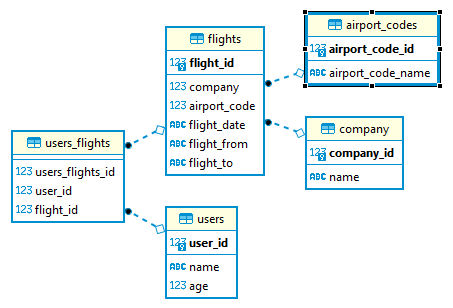

## Spring MVC + Hibernate
Домашнее задание в рамках стажировки.

## Функционал
Простое CRUD-приложение с базой данных (postgresql) на 5 таблиц. Приложение написано на Spring MVC + Hibernate. 
 Взаимодействие настроено в HTML через Thymeleaf. 
*Навигация по таблицам*: http://localhost:8080/spring-mvc-hibernate/flight

## Работа с БД

## Автор
Со мной можно связаться в [Telegram](https://t.me/welderdefender).
 welderdefender@yandex.ru